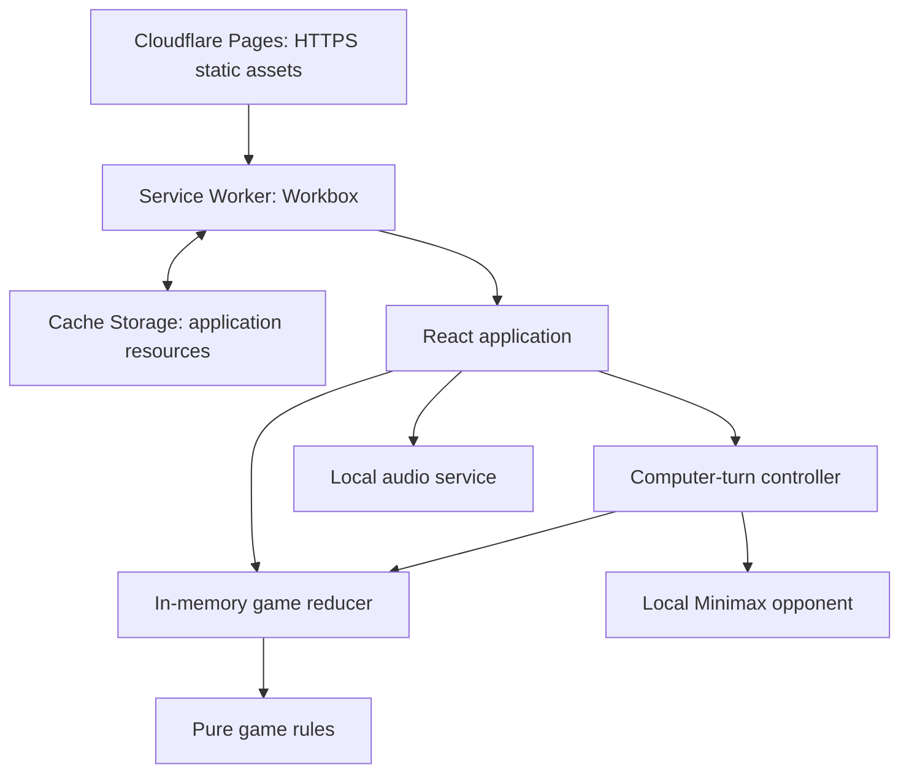
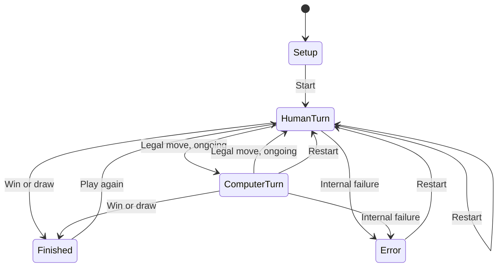

# Tic-Tac-Toe PWA — Technical Architecture

Version: 1.0  
Date: October 4, 2026  
Scope: MVP  
Language: English

## 1. Authority and scope

This architecture translates PRD.md version 1.0 and the technology-stack recommendation in the preceding conversation into implementation contracts. The stack recommendation was provided in the conversation, not as a separate saved Stack Technology file. The user's request to create this architecture is treated as authorization to use that recommendation as its basis.

No material conflict exists between those sources. The application is an English-language, free, ad-free, single-player 3×3 Tic-Tac-Toe game for children, with a local computer opponent, selectable difficulty, session counters, optional sounds and animations, and offline PWA operation.

Requirements explicitly stated in the PRD take precedence over implementation defaults below. Defaults such as mistake probabilities, sound settings, and move delays are technical decisions for a runnable MVP, not user-supplied product facts. This document contains no development schedule or task plan.

## 2. System structure

Use a client-rendered static application. All gameplay executes on the user's device. Cloudflare Pages serves the compiled application and its assets over HTTPS; it does not execute game rules or store player data.



Arrows represent interaction, not a requirement that a Service Worker control the first page load. Before a worker is active, the browser loads resources directly from the host. Once installed, the worker serves precached resources for subsequent requests.

### Technology decisions

| Concern | Decision | Reason |
| --- | --- | --- |
| Frontend | React + TypeScript | Mature component ecosystem and explicit domain contracts. |
| Build | Vite with its React plugin | Static output and straightforward TypeScript integration. |
| Styling | CSS Modules, Grid, CSS animations | Small dependency surface and sufficient visual capabilities. |
| State | useReducer; useState for transient UI | One authoritative game state without a global-state library. |
| PWA | vite-plugin-pwa with Workbox generateSW | Established caching tooling with Vite integration. |
| Computer | Local Minimax with controlled suboptimal choices | Offline, legal, tunable, and beatable at every difficulty. |
| Audio | HTMLAudioElement using local files | Adequate for short effects without another library. |
| Hosting | Cloudflare Pages | Managed HTTPS and static CDN delivery. |
| Repository | Git + GitHub | Source control and hosting integration. |
| Verification tools | Vitest + Playwright | Pure rules and browser behavior, including offline flows. |
| Backend, database, authentication | None | No remote or persistent player-data requirement. |

Use stable, mutually compatible releases and commit the npm lockfile. Use a supported Node.js LTS version satisfying the selected Vite version's engine requirements, with npm and npm ci. Node.js is a build tool only. No production Node server, SSR, React Server Components, Redux, router, AI SDK, or server-data library is required.

## 3. Frontend components and module boundaries

The application uses one URL, `/`, and switches between setup and gameplay using in-memory state. Browser routing is unnecessary.

| Component or module | Responsibility |
| --- | --- |
| App / AppErrorBoundary | Own the application instance, recovery UI, and top-level composition. |
| SetupPanel | Difficulty selection and Start Game. |
| GameScreen | Board, turn status, result, session counters, and restart/replay controls. |
| Board / CellButton | Accessible nine-cell rendering; dispatch cell selection. No game-rule duplication. |
| DifficultySelector | Select next difficulty between matches; disabled during an unfinished match. |
| Scoreboard | Display wins, losses, and draws from the human player's perspective. |
| SettingsPanel | Independent sound and animation toggles; local UI state. |
| PwaStatus | Offline readiness and non-blocking update notice. |
| useGameController | Connect reducer, opponent scheduling, cancellation, and accepted transition feedback. |
| rules.ts | Legal moves, immutable board updates, win/draw evaluation. |
| reducer.ts | Authoritative transitions, counter updates, stale-action rejection. |
| opponent.ts | Minimax scoring and difficulty-based legal move selection. |
| audio.ts | Lazy initialization, effect playback, mute and disposal. |
| pwa/register.ts | Single service-worker registration, readiness and update signals. |

Suggested source organization:

| Path | Contents |
| --- | --- |
| src/main.tsx | Mount React, import global CSS, enable StrictMode during development. |
| src/app/ | App, error boundary, shared layout. |
| src/features/game/domain/ | Types, rules, reducer, opponent, difficulty configuration. |
| src/features/game/components/ | Board, cells, setup, result, scoreboard. |
| src/features/game/hooks/ | Game orchestration and computer-turn effects. |
| src/features/settings/ | Feedback settings UI. |
| src/services/ | Local audio service. |
| src/pwa/ | Registration and update integration. |
| src/styles/ | Global tokens and responsive base styles. |
| public/icons/ | App icons, maskable icon, Apple touch icon. |
| public/sounds/ | Short local effects with versioned filenames. |
| public/_headers | Cloudflare Pages static-response headers. |
| tests/ | Domain checks and browser specifications. |
| vite.config.ts | Build, React plugin, PWA manifest and precache settings. |

Domain modules must not import React, DOM APIs, hosting SDKs, or network clients. Components must not write directly to the board or counters. The reducer remains pure: no timers, randomness, audio, cache operations, or network requests.

## 4. Domain model and in-memory storage

There is no database schema, remote collection, ORM, or migration. The following structures are runtime data contracts:

```typescript
type Mark = 'X' | 'O';
type Cell = Mark | null;
type Board = readonly [Cell, Cell, Cell, Cell, Cell, Cell, Cell, Cell, Cell];
type Difficulty = 'easy' | 'medium' | 'hard';
type Phase = 'setup' | 'human-turn' | 'computer-turn' | 'finished' | 'error';
type Outcome = 'human-win' | 'computer-win' | 'draw' | null;
type WinningLine = readonly [number, number, number];

interface GameState {
  board: Board;
  phase: Phase;
  outcome: Outcome;
  winningLine: WinningLine | null;
  difficulty: Difficulty;
  selectedDifficulty: Difficulty;
  matchId: number;
  ply: number;
  scores: { wins: number; losses: number; draws: number };
  settings: { soundEnabled: boolean; animationsEnabled: boolean };
  error: string | null;
}
```

Indices are row-major from 0 to 8. X is the human, O is the computer. The human starts every match. `matchId` is a local monotonically increasing generation identifier, not a user or device identifier. `ply` is the number of accepted moves in the current board.

Initial technical defaults: Medium selected; empty board; setup phase; zero scores; sound enabled; animations enabled; matchId and ply zero. Audio remains silent until a user gesture allows playback. Effective animation playback also depends on the operating system's reduced-motion preference.

### Storage and lifecycle contracts

| Data | Location | Lifetime |
| --- | --- | --- |
| Board, scores, difficulty, settings | Application memory | Current running document instance. |
| Pending computer timer | Controller effect/ref | Current scheduled turn only. |
| Audio objects | Local audio service | Current running document instance. |
| App HTML, JS, CSS, icons, sounds | Browser Cache Storage | Until cache replacement, eviction, or user deletion. |
| Player information and match history | Not collected | Not applicable. |

Do not use localStorage, sessionStorage, IndexedDB, cookies, URL parameters, or Service Worker messages to persist gameplay or preferences. Do not synchronize tabs. Each tab or installed window is a separate session.

Refreshing or a full document reload initializes all state again. Backgrounding preserves state while the document survives. An OS-triggered reload resets it. A pageshow event with `persisted=true` resets state to prevent restoring a previous session through the back-forward cache. Best-effort pagehide cleanup cancels timers and audio; correctness must not depend on unload events being delivered. If a browser restores a closed window without creating a new document, closure cannot be detected reliably; no persisted restoration is intentionally supported.

## 5. State machine and game correctness



### Reducer action contracts

| Action | Allowed state and effects |
| --- | --- |
| SELECT_DIFFICULTY(value) | Setup or finished only; set selectedDifficulty without changing a board or counters. |
| START_MATCH | Setup only; increment matchId, capture selectedDifficulty, clear board, enter human-turn. |
| HUMAN_MOVE(index) | Human-turn only and integer index 0–8 on an empty cell; place X and evaluate immediately. |
| COMPUTER_MOVE(index, matchId, expectedPly) | Computer-turn only; generation and ply must match; index must be legal; place O and evaluate immediately. |
| RESTART_MATCH | Current match or error; increment matchId, clear board/result/error, retain active difficulty and counters, enter human-turn. |
| PLAY_AGAIN | Finished only; increment matchId, capture selectedDifficulty, clear board/result, retain counters, enter human-turn. |
| SET_SOUND(enabled) / SET_ANIMATIONS(enabled) | Any phase; update only the respective setting. |
| GAME_ERROR(message, matchId) | Current matching generation only; lock board, enter error, retain counters. |

Every accepted move copies the board, increments ply, and evaluates all eight winning lines before a draw. If a result occurs, set finished and increment the matching score in the same reducer transition. A duplicate action then fails its phase or ply guard and cannot count the result again. If ongoing, switch to the other turn.

Rules and invariants:

- X count equals O count or exceeds it by one.
- Before a human turn, counts are equal; before a computer turn, X has one extra mark.
- A completed board cannot accept another move.
- Invalid human input is ignored without changing turn, result, or counters.
- Abandoned matches do not change counters.
- Match restart never opens a confirmation dialog.
- Restart preserves the active match difficulty; replay can use a newly selected difficulty.
- Domain functions should reject unreachable/corrupt states when called directly; the reducer prevents them through normal UI actions.

## 6. Computer-opponent contract

Implement Minimax in TypeScript for the nine-cell board, evaluating outcomes from O's perspective: computer win +1, draw 0, human win -1. Enumerate all legal successor moves and alternate maximizing O and minimizing X. Prefer faster wins and slower losses only as a tie-break within the same outcome category. Do not replace outcome scores with depth scores when classifying mistakes.

### Difficulty selection

For each turn, partition legal moves into best-outcome moves and strictly worse-outcome moves. On the strategic branch choose a best-outcome move. On the mistake branch choose a strictly worse-outcome move when available; otherwise choose a best-outcome move. Random tie-breaking among equally good moves creates variety, but does not count as a mistake.

| Difficulty | Initial mistake-branch probability |
| --- | --- |
| Easy | 0.50 |
| Medium | 0.25 |
| Hard | 0.10 |

These are tunable architecture defaults, not promised player win rates. Mistakes are possible only when a worse legal move exists. Every level remains strategic on its other branch. Hard must have reachable moves that permit a human win; do not impose unconditional win/block rules that eliminate all such opportunities. Do not guarantee a mistake or a human win in each match.

Inject an RNG function returning a value in [0, 1) for deterministic checks. Production may use Math.random because gameplay randomness is not a security function. Reuse minimax evaluations within one decision if useful; any memoization must remain in memory. No model training, external API, or downloaded AI model is used.

Run this small computation on the main thread initially. No Web Worker is required for the MVP. The Service Worker handles caching only and must never act as the opponent.

### Turn scheduling and cancellation

Use an initial 400 ms computer delay to make turn changes perceptible. It is a technical default, independent of animation settings.

When entering computer-turn, capture matchId, ply, difficulty, and an immutable board snapshot. Schedule exactly one timer in a React effect; clear it on dependency changes and unmount. On expiry, choose a move and dispatch COMPUTER_MOVE with the captured identifiers. The reducer revalidates it against current state.

The two layers—timer cleanup and reducer generation/ply checks—prevent a stale move after restart, and duplicate moves under StrictMode effect re-execution. If the page is hidden, cancel the timer; on return schedule a fresh delay for the still-current computer turn. A recoverable opponent exception dispatches a guarded GAME_ERROR and exposes Restart, without sending diagnostics anywhere.

## 7. Internal APIs and HTTP resources

There is no application REST API, GraphQL API, WebSocket, authentication endpoint, or server-side game session. Local TypeScript function interfaces are the application's APIs:

```typescript
getLegalMoves(board: Board): readonly number[];
applyMove(board: Board, index: number, mark: Mark): Board;
evaluateBoard(board: Board): {
  outcome: Outcome;
  winningLine: WinningLine | null;
};
chooseComputerMove(board: Board, difficulty: Difficulty, rng: () => number): number;
gameReducer(state: GameState, action: GameAction): GameState;
```

`chooseComputerMove` accepts only a valid non-terminal computer-turn board and returns an empty-cell index; invalid input produces an internal error. `GameAction` is a discriminated union corresponding to the reducer table. `evaluateBoard` returns null outcome on an unfinished board.

HTTP GET resources are `/`, `/index.html`, the generated manifest, `/sw.js`, any generated Workbox helper, hashed `/assets/*`, `/icons/*`, and `/sounds/*`. The manifest filename must match the plugin output. POST/PUT/DELETE application endpoints are not defined. Hosting responses must not expose an application API under `/api/*`.

## 8. PWA, caching, and update behavior

Use vite-plugin-pwa with `strategies: 'generateSW'` and `registerType: 'prompt'`. Register once using its virtual registration module, with external registration/script output rather than inline executable scripts. Keep `skipWaiting` false for normal updates; request activation only through the update action.

### Manifest and assets

Set a stable manifest id, start_url `/`, scope `/`, display `standalone`, English language, application name Tic-Tac-Toe, and suitable theme/background colors. Do not lock screen orientation. Provide 192×192 and 512×512 icons, a maskable icon, and an Apple touch icon. Final colors and visual artwork remain design choices.

Explicitly precache all HTML, JS, CSS, icons, and audio required for every game path. Include public sound/icon files through plugin configuration; do not assume default glob patterns include audio. Include all chunks needed by settings and all difficulties. Use local system fonts; no external font or media requests.

Use Workbox's generated revision manifest. Build failure is preferable to silently excluding a required oversized asset: verify required asset coverage and file-size limits in the output. Version public audio filenames when changing them to reduce HTTP-cache mismatch risk.

Use the precached index.html as the application navigation fallback at the root. Do not turn missing JS, audio, icons, or `/api/` requests into HTML. No generic runtime cache for third-party requests is needed. Keep obsolete-precache cleanup enabled and let Workbox manage its own revisions; never indiscriminately delete origin caches.

### Readiness and failures

An active worker with completed required precaching provides offline availability. Use plugin readiness/registration signals to present a small non-blocking status. Never infer readiness solely from navigator.onLine or installation to the home screen. Readiness describes current known cache availability, not a permanent guarantee.

If registration or caching fails, continue online browser gameplay and show that offline availability could not be prepared. Retry when the app returns to an online, visible state, without blocking play or sending telemetry. First-ever offline launch may show the browser's own failure screen because no app resources exist yet.

### Safe updates

When a new worker is waiting, retain the running application. Show an Update action only at setup, after a result, or after recovery; do not interrupt a match. Label the action “Update and reset session” so the effect on counters and settings is clear. Activation intentionally reloads and resets in-memory state, as required for any refresh. A user may defer it.

Multiple tabs share the worker and caches but not game state. If another tab activates an update, an active match in this tab must not be automatically reloaded on controllerchange. The existing application is fully loaded; defer this tab's reload until it is at a safe state and the user chooses it. Do not lazy-load gameplay modules that could disappear during cache cleanup. Verify the selected plugin registration behavior respects this contract; its default convenience reload callback is not sufficient if it reloads active matches in other tabs.

No forced timed refresh, push notification, background synchronization, or cross-tab gameplay messaging is included. A hosting rollback is received as another application update; it does not bypass the worker lifecycle.

## 9. UX, accessibility, and feedback

Render the board as a CSS Grid of native buttons, with accessible labels describing row, column, and occupancy. Support keyboard Tab and Enter/Space; advanced grid keyboard navigation is not required. Use a polite live region for turn and outcome announcements. Represent the winning line visually and through result text, not color alone.

Initial technical UI targets: primary controls at least 44×44 CSS pixels, readable text, WCAG AA text contrast, and clear focus indicators. These are design acceptance defaults rather than additional product features. Use responsive layout, safe-area insets, and dynamic viewport sizing with fallback. Allow scrolling on short landscape screens rather than hiding controls. Do not disable user zoom.

Keep settings visible through a simple accessible panel; opening it must not restart the match. Disable difficulty changes during an unfinished match, but keep restart and feedback settings available. English copy includes “Your turn,” “Computer's turn,” “You win,” “Computer wins,” and “Draw.” No tutorial screen is added.

Use CSS transitions/keyframes for move appearance and result emphasis. Effective animation is `animationsEnabled && !prefersReducedMotion`. Track OS preference changes during a session. Game state and input readiness must not depend on animation completion events. Match-keyed animations must disappear on restart.

Create a small reusable audio pool only after the first user interaction. Cache playable local MP3 effects; no remote audio library or third-party audio fetch. Play move and outcome sounds only for accepted state transitions, with a deduplication key containing matchId, ply, and event type. Ignore playback-promise rejection and retain visual feedback. Muting stops active sounds; restart stops old result sounds; pagehide/disposal stops audio. A sound failure must never put the game into an error phase.

## 10. Cloud infrastructure and integrations

The production output is the Vite dist directory deployed to Cloudflare Pages. GitHub is the source of truth; Pages' repository integration builds the chosen production branch and provides isolated preview origins. Vite base is `/`. Use an HTTPS pages.dev address initially; a custom domain is optional and does not change domain logic.

The only required external integration is GitHub-to-Pages deployment. There are no Pages Functions, Workers game handlers, database services, object-storage buckets, email providers, payment systems, ad networks, analytics SDKs, or AI providers.

Environment configuration contains public build configuration only. Never place secrets in VITE-prefixed variables: they are compiled into client assets. Domain names, branch names, and final visual values are project configuration, not reasons to introduce new services.

Preview builds must keep their Service Worker and Cache Storage isolated by origin from production. Use the production build and local preview to verify worker behavior; do not enable a persistent development worker by default because stale development caches complicate debugging.

The CDN distributes application resources. Match computation is local, so additional players do not consume application compute or database operations. Costs are hosting-plan dependent and a custom domain may cost extra. Do not encode current free-tier quotas as application assumptions. No containers, Kubernetes, queue, or distributed application infrastructure is required.

## 11. Security and privacy

The runtime has no authentication or authorization because it holds no protected user data or privileged actions. Do not add anonymous sign-in, device IDs, or cookies. Hosting and repository accounts should use MFA and least-privilege access; credentials remain outside the app bundle.

Serve production over HTTPS. Render labels through normal React text handling; no dangerouslySetInnerHTML, eval, or remote executable code. Validate move indices and state transitions regardless of disabled controls. Client-side state is modifiable by users; this is acceptable because there are no prizes, shared rankings, or server authority to protect.

Configure static response headers through public/_headers:

| Header or rule | Policy |
| --- | --- |
| Content-Security-Policy | `default-src 'self'; script-src 'self'; style-src 'self'; img-src 'self' data:; media-src 'self'; font-src 'self'; connect-src 'self'; worker-src 'self'; manifest-src 'self'; object-src 'none'; base-uri 'self'; frame-ancestors 'none'; form-action 'none'` |
| X-Content-Type-Options | `nosniff` |
| Referrer-Policy | `no-referrer` |
| Permissions-Policy | Disable camera, microphone, and geolocation. |
| /index.html and root document | Revalidate HTTP cache; no immutable policy. |
| /sw.js and manifest | Revalidate HTTP cache; never cache immutably. |
| Content-hashed build assets | Long-lived immutable HTTP caching. |
| Unversioned icons/media | Revalidate; versioned names may use immutable caching. |

Use external stylesheets and scripts compatible with the CSP; avoid inline style attributes and inline script registration. Development server policy can differ locally. Verify headers on actual static responses, including the root and generated worker. No cross-origin API calls or CORS configuration is needed.

The app must not send gameplay events, errors, scores, names, identifiers, or device fingerprints. Do not enable Cloudflare Web Analytics or inject remote error-reporting tools. Hosting infrastructure may process IP addresses and operational access/security logs; this architecture does not claim zero data processing by the hosting provider. Keep app-level telemetry absent.

## 12. Reliability and verification contracts

| Concern | Required evidence or invariant |
| --- | --- |
| Rules | Every row, column, diagonal, draw, full-board win, and illegal input behaves correctly. |
| Opponent | Every returned move is legal; seeded RNG demonstrates strategic choices and strictly worse choices at all levels. |
| Hard beatability | Reachable human-win paths exist when a mistake branch is taken; optimal branches still select best-outcome moves. |
| Counters | Exactly one increment per terminal match; unfinished restart increments none. |
| Concurrency | Rapid taps, duplicate callbacks, StrictMode effects, and restart during delay cannot add extra or stale moves. |
| Reset | Refresh, fresh document launch, and restored back-forward-cache entry initialize a new session. |
| Feedback | Independent toggles, reduced motion, and blocked audio preserve gameplay. |
| Offline | Fresh online precache followed by offline launch supports setup, every difficulty, completion, restart, replay, and settings. |
| Updates | A waiting worker does not interrupt any active tab's match; user-triggered reload resets the session. |
| Mobile | Android Chrome and iOS Safari in browser and installed mode, portrait/landscape, touch and safe-area behavior. |
| Privacy | Runtime requests contain no gameplay telemetry; no persistent player state is written. |

Use Vitest for pure modules with injected RNG and fake timers where appropriate. Use Playwright for full production-build browser behavior and network isolation. Browser emulation is supplemented by real mobile-device checks; WebKit automation is not proof of all iOS installed-PWA behavior.

The PRD's approved success targets remain at least 90% independent match starts in usability testing and 100% of planned offline checks passing. No production analytics is introduced to measure them. Exact browser-version coverage is a documented compatibility policy, not “all historical mobile devices.” Default support is current stable and the immediately preceding major release of Android Chrome and iOS Safari at release time; if build targets exclude either, adjust output compatibility or explicitly revise the policy rather than silently dropping support.

Top-level unexpected rendering errors show a simple recovery action without technical details or telemetry. Recovery remounts the game subsystem and resets the session; a full page reload is a fallback and must clearly indicate reset. AI errors retain counters until a restart. Cache/audio failures degrade the related capability without corrupting the game.

## 13. Technical decisions and extension boundaries

| Decision | Explanation |
| --- | --- |
| No backend/database/auth | Consistent with no persistent history, account, or multiplayer requirement. |
| React rather than a full-stack framework | The MVP needs local interaction, not server rendering or server-data orchestration. |
| One root route | Setup, game, settings, and result are a small local flow. |
| Minimax plus suboptimal branch | Preserves strategic play while keeping Hard beatable. |
| Medium default; 50/25/10% mistake branch | Explicit initial tuning choices; probabilities are configurable constants. |
| 400 ms opponent delay | Makes turn changes visible without depending on animation. |
| Session-only settings and scores | Refresh semantics are predictable and meet the PRD. |
| Update prompt rather than automatic refresh | Prevents accidental match loss; updates are offered at safe states. |
| All gameplay resources locally packaged | Avoids network dependence during a cached offline session. |
| Main-thread opponent | Sufficient for 3×3 search; no extra worker messaging needed. |

Future accounts, multiplayer, synchronized history, and monetization would require new product decisions and likely a revised architecture. Do not provision those systems speculatively. Preserve the pure domain boundary so rules can be reused if such changes are approved later.

## 14. Implementation-source references

The product source is PRD.md. The stack source is the technology research and recommendation in the preceding conversation. The following official technical documentation supports platform-specific implementation details; it does not override this document's product behavior:

- [React: Build an app from scratch](https://react.dev/learn/build-a-react-app-from-scratch)
- [Vite guide](https://vite.dev/guide/)
- [Vite PWA guide](https://vite-pwa-org.netlify.app/guide/)
- [Vite PWA update prompts](https://vite-pwa-org.netlify.app/guide/prompt-for-update.html)
- [Vite PWA static assets](https://vite-pwa-org.netlify.app/guide/static-assets.html)
- [Workbox documentation](https://developer.chrome.com/docs/workbox/)
- [Cloudflare Pages static headers](https://developers.cloudflare.com/pages/configuration/headers/)
- [MDN: PWA installation](https://developer.mozilla.org/en-US/docs/Web/Progressive_web_apps/Guides/Making_PWAs_installable)
- [MDN: Storage quotas and eviction](https://developer.mozilla.org/en-US/docs/Web/API/Storage_API/Storage_quotas_and_eviction_criteria)
- [Berkeley CS188: Minimax](https://inst.eecs.berkeley.edu/~cs188/textbook/games/minimax.html)
- [Vitest](https://vitest.dev/guide/)
- [Playwright device emulation](https://playwright.dev/docs/emulation)
